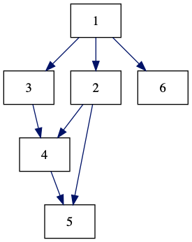

## OCamlgraph example

OCamlgraph is a graph library for OCaml. In this example, we use Ocamlgraph
to represent a graph, traverse the graph, and export the graph as
graphViz dot file.

Let us write an OCaml graph that represents the following graph.
```
   (6)
   /
  /
(1)---(2)
 |     | \
 |     |  (5)
 |     | /
(3)---(4)
```
First, let us define the Vertex and Edge.
```
module Node = struct                                                                
   type t = int                                                                     
   let compare = Pervasives.compare                                                 
   let hash = Hashtbl.hash                                                          
   let equal = (=)                                                                  
end                                                                                 

module Edge = struct                                                                
   type t = string                                                                  
   let compare = Pervasives.compare                                                 
   let equal = (=)                                                                  
   let default = ""                                                                 
end
```
Now, we create the graph
```
module G =  Graph.Persistent.Digraph.ConcreteBidirectionalLabeled(Node)(Edge)
let g = G.empty
```

Create a vertex
```
let v1 = G.V.create 1;;
```
Now, add the vertex to the graph G
```
let g = G.add_vertex g v1;;
```
Add other vertices
```
let g = G.add_vertex g (G.V.create 2)
let g = G.add_vertex g (G.V.create 3)
let g = G.add_vertex g (G.V.create 4)
let g = G.add_vertex g (G.V.create 5)
let g = G.add_vertex g (G.V.create 6)  
```

Display all the added vertices
```
G.iter_vertex (fun x->Caml.print_int x)) g
```
Add edges to the graph
```
let g = G.add_edge g 1 2
let g = G.add_edge g 1 3
let g = G.add_edge g 2 4
let g = G.add_edge g 3 4
let g = G.add_edge g 2 5
let g = G.add_edge g 4 5
let g = G.add_edge g 1 6 
```
print the adjacent vertices of vertex 1
```
List.iter print_int (G.succ g 1)
```

Now, let us traverse the graph using BFS
```
module M1 = Traverse.Bfs(G)
M1.iter (fun x-> print_int x) g   
```

Now, let us save the graph in GaraphViz dot file.
```
module Dot = Graph.Graphviz.Dot(struct
   include G (* use the graph module from above *)
   let edge_attributes (_, e, _) = [`Label e; `Color 4711]
   let default_edge_attributes _ = []
   let get_subgraph _ = None
   let vertex_attributes _ = [`Shape `Box]
   let vertex_name v = string_of_int v
   let default_vertex_attributes _ = []
  let graph_attributes _ = []
end)

let _ =
   let file = open_out_bin "mygraph.dot" in
   Dot.output_graph file g 
```
Here is the output



To compile:
```
dune build bfs.exe
```
to execute:
```
dune exec ./bfs.exe
```
or
```
_build/default/bfs.exe
```

Full code is here [https://github.com/anwarmamat/anwarmamat.github.io/tree/master/ocaml/ocamlgraph](https://github.com/anwarmamat/anwarmamat.github.io/tree/master/ocaml/ocamlgraph)
OCamlgraph is a powerful graph library. For more details, please read here: http://ocamlgraph.lri.fr/index.en.html

