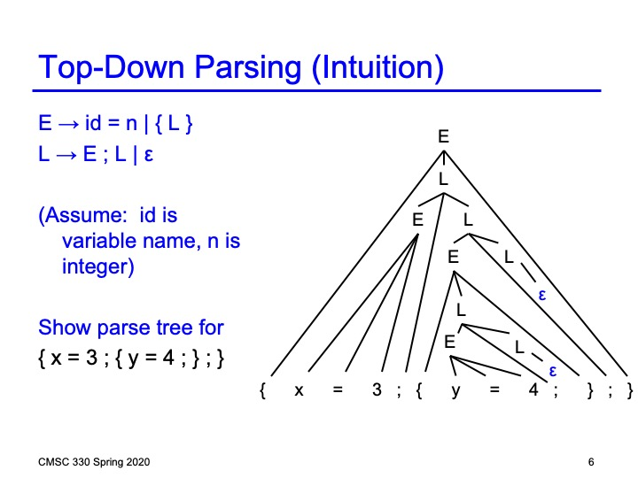

# Lexer and Parser for the lecture example
Write a lexer and parser for the Context Free Gramer
```
E->id=n|{L}
L->E;L|e
```



## Parser generates the following parse tree


## How to run
### Compile
```
dune build bin/main.exe
```
### Run
```
_build/defult/bin/main.exe
```
### See the parse tree
```
xdot parsetree.dot
```
